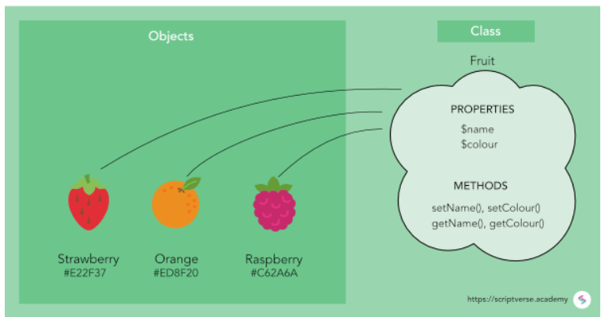

//---------------------------------------------------------------------------
:icons: font
:sectnums:
//= Introduction
:doc-part:  
//:figure-caption: Figure {doc-part}- 
:figure-caption: Figure  
:xrefstyle: short 
//---------------------------------------------------------------------------
== Classes & Objects
=== General 
Class and Object are two most important concepts of an Object oriented programming language. The main difference between the two is that class is a blueprint which is used to create different objects of the same type.

The information in this chapter is found in:
link:http://www.differencebetween.info/difference-between-object-and-class[Difference-between-object-and-class]

=== Class
A class is said to be a blueprint of an object. 

It is an extensible guide used for creating objects; it is a subroutine that creates an object. A class does not represent the object; it represents all the information and methods an object should have. One class can be used to instantiate multiple objects. It is considered to be an extended TYPE declaration

A class is a template used to create an object.

=== What is the difference between a class and an object

A class is a blueprint or prototype that defines the variables and the methods (functions) common to all objects of a certain kind.

A class holds the methods and properties that are shared by all of the objects that are created from it.

An object is a specimen of a class. Software objects are often used to model real-world objects you find in everyday life. 

=== Object

An object contains properties and methods which are needed to make a certain type of data useful. An object’s properties are what it knows and its methods are what it can do. The methods provide functionality to applications and ensure that an object’s data is being used properly. Methods also allow the actual execution of tasks to be hidden and to be standardized for particular operations for different types of objects. Methods are used to access the objects of a class. All the interaction is done through the object’s methods. This is known as data encapsulation. The objects are also used for data or code hiding.

Although the objects share the same code, they can behave differently because they can have different values assigned to them.

=== Properties & Methods

An object's properties are what it knows and its methods are what it can do.

[#fig:{doc-part}:classes_objects] 
[.center.text-center] 
[title="Object with properties and methods"] 
image::./images/figures/classes_objects.png[float="center", align="center"] 

=== Example: Dog class

[#fig:{doc-part}:example_class_dog] 
[.center.text-center] 
[title="Example - Dog Class (link:https://www.guru99.com/[www.guru99.com])"] 
image::./images/figures/example_class_dog.png[float="center", align="center"] 

=== Example: Fruit

[#fig:{doc-part}:example_class_fruit] 
[.center.text-center] 
[title="Example - Fruit Class (link:https://scriptverse.academy/tutorials/php-oops-classes-objects.html/[https://scriptverse.academy/])"] 
 

=== Useful links

* link:http://www.differencebetween.info/difference-between-object-and-clas[Difference-between-object-and-class]

* link:http://leetusman.com/intermediate-programming/posts/classes-and-objects/[Classes and Objects in Javascript ES6]

* link:https://www.guru99.com/java-oops-class-objects.html[Class Dog example]

* link:https://slideplayer.com/slide/8974938/[Tutorial video]

* link:https://phpenthusiast.com/object-oriented-php-tutorials/create-classes-and-objects[Create classes and objects]

