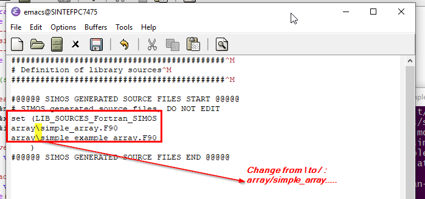
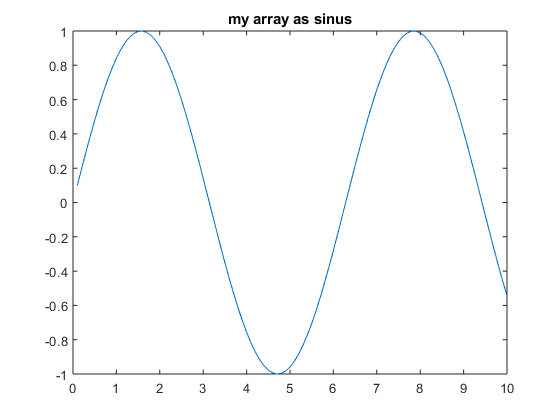

//---------------------------------------------------------------------------
:icons: font
:sectnums:
//= Introduction
:doc-part:  
//:figure-caption: Figure {doc-part}- 
:figure-caption: Figure  
:xrefstyle: short 
//---------------------------------------------------------------------------
== Examples

=== General

This chapter includes a several examples covering 

.  Modelling the Data (json-file)
.  Generating Source Code. The options are
    * Python
    * Matlab
    * Fortran (f90)
.  Use generate code  

link:https://stash.code.sintef.no/projects/SIMOS/repos/simos-fortran-examples/browse/results-storage/[]

=== Simple Example
==== Modelling the Data

Let us define the json-file describing the data

. A data type with name _simple_array_
. The data type  _simple_array_ has has two properties
    * one double variable with name _x_
    * one integer array with name _i_arr_

----
{
    "name": "simple_array",
    "description": "A very simple type",
    "extends": ["marmo_r1:basic:NamedEntity"],
    "properties": [
        {
            "name": "x",
            "type": "double",
            "description": "A double precision value"
        },
        {
            "name": "i_arr",
            "type": "integer",
            "dim": "*",
            "description": "An integer array"
        }
    ]
}

----

==== Generate Code (Fortran)

==== simple_array
When we run the code generator, we will get a Fortran source file with a type which looks something like this:
----
(...)
type   :: simple_array
        private
        ! A double precision value
        real(dp), public :: x
        ! An integer array
        integer, dimension(:), allocatable, public :: i_arr
        ! variable name for named accessing
        type(String), public :: name
        ! instance description
        type(String), public :: description
(...)
----

As we can see, SIMOS generated variables for the entries we added to the properties section of the JSON file. SIMOS also added to other variables, name and description. This is because our JSON-file says that our data type "extends" marmo_r1:basic:NamedEntity and is needed if we want to save our instance to a file.

NOTE: By convention, all types that we would like to save to a file must have a name.

IMPORTANT: for each json file you have made, there is created a fortran module with the class-type. In addition there is one main module file that refers to the c class module-file. In the fortran file refered to in your code is the main module file, see <<#fig:{doc-part}:name_on_submodules_fortran>>.

[#fig:{doc-part}:name_on_submodules_fortran] 
[.center.text-center] 
[title="Modules in fortran  (example: simos/simos-fortran-examples/simple_array/mainf.90 and simos/simos-fortran-examples/simple_array/libraries/simple_example/simple_example_r1/src_gen/array)"] 
image::./images/figures/name_on_submodules_fortran.png[float="center", align="center"] 

==== Apply Generated Code: Fortran

===== Get Submodules

If this the first time you are using the fortan code, you need several submodules. The submodules are

. fcore
. h5storage
. simos

To get the submodules

. Move the the git-folder, _for example the simos folder_
. clone the repo *simos-fortran-examples*
.. git clone ssh://git@git.code.sintef.no/simos/simos-fortran-examples.git
. initiate the submodules 
.. git submodules update --init --recursive

===== Compile the Code - sinesim example

An example, *sinesim*, is in the folder, *simos-fortran-examples\results-storage\*

. Move to the folder *results-storage*
. Make a build folder
.. mkdir build
. move to folder: 
.. cd build/
. In Mintty: Compile the fortran code using the following steps
.. cmake .. -G"NMake Makefiles JOM"
.. jom

Run the program

. sinesim 3

===== Compile the Code - simple_array example

An example, *simple_array*, is in the folder, *simos-fortran-examples\simple_array\*

. Move to the folder *simple_array*
. Make a build folder
.. mkdir build
. move to folder: 
.. cd build/
. In Mintty: Compile the fortran code using the following steps
.. cmake .. -G"NMake Makefiles JOM"
.. jom

NOTE: Before you compile, you have to set up the _CMakeList.txt_-file correct. This included to add path to the new libraries inn addition to the submodules _fcore_ and _h5storage_. Example is shown in <<#fig:{doc-part}:CMakeLists>>.

NOTE: it is observed a bug compiling the code on Windows. This is related to backslash (/). The fix is shown in <<fig:{doc-part}:bug_windows_back_shlash>>

[#fig:{doc-part}:CMakeLists] 
[.center.text-center] 
[title="CMakeLists.txt.  (example: simos/simos-fortran-examples/simple_array/CMakeLists.txt)"] 
image::./images/figures/CMakeList.png[float="center", align="center"] 

[#fig:{doc-part}:bug_windows_back_shlash] 
[.center.text-center] 
[title="Observed error in Windows: src_gen/cmake/libsources.cmake"] 
 

Run the program

. simple

EXAMPLE: SIMPLE_ARRAY

----
program main_simple_array
  use class_string
  !----------------------------------------------------------------
  ! simple prohram to create an object of type simple_array
  !----------------------------------------------------------------
  use simple_example_array, only : simple_array
  !
type(simple_array) :: var1, var2

! Create some data
var1%name = 'My Data'
var1%x = 123.0
var1%i_arr = [1, 1, 2, 3, 5, 8, 13]

! Save it to a file
call var1%save_hdf5(string('my_data.h5'))

print*,' Load it into the other variable, var2'
print*,' Prints var2%i_arr to the console '
call var2%load_hdf5(string('my_data.h5'), string('My Data'))
write(*, *) var2%i_arr ! 
----

Result:

EXAMPLE: dsaad 

-----
grob@SINTEFPC7475 MINGW64 /c/git/simos/simos-fortran-examples/simple_array/build (simple_array_example)
$ simple
  Load it into the other variable, var2
  Prints var2%i_arr to the console
           1           1           2           3           5           8

-----

==== Apply Generated Code: Matlab

----
%--------------------------------------------------------------------------
% make a simple array using a sinus signal
%--------------------------------------------------------------------------
dt=0.1;
timesteps=dt:dt:10;
%--------------------------------------------------------------------------
% make an object: type simple_array()
%--------------------------------------------------------------------------
my_array=simple_example_r1.array.simple_array();
my_array.x=dt;
my_array.i_arr=sin(x);
my_array.description='my array as sinus';
%--------------------------------------------------------------------------
% make a plot
%--------------------------------------------------------------------------
figure(1)
plot(timesteps,my_array.i_arr);
title(my_array.description);
%--------------------------------------------------------------------------
% end
%--------------------------------------------------------------------------
----

Result:

[#fig:{doc-part}:simple_array] 
[.center.text-center] 
[title="Example - Simple array as sinus signal"] 
 