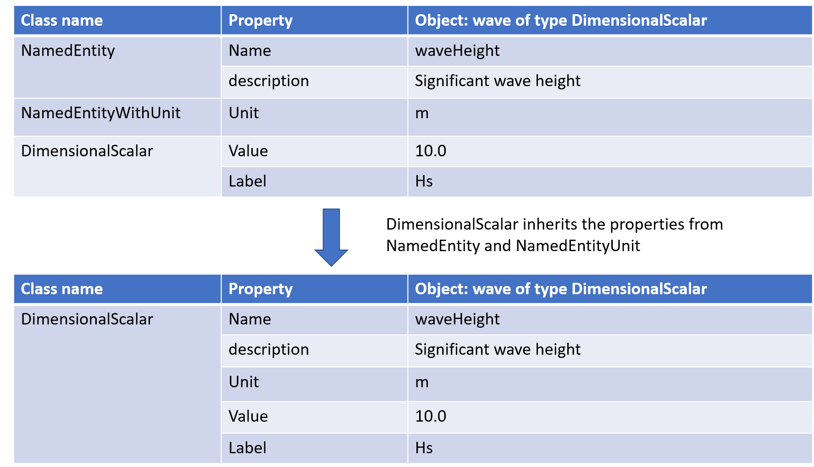
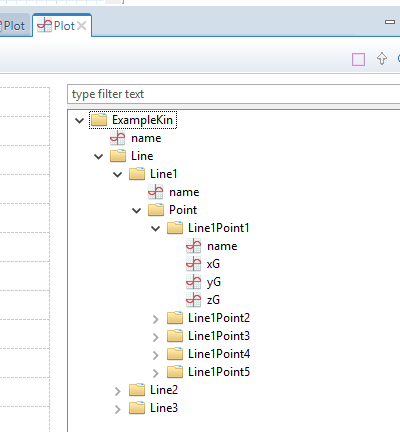

//---------------------------------------------------------------------------
:icons: font
:sectnums:
//= Introduction
:doc-part:  
//:figure-caption: Figure {doc-part}- 
:figure-caption: Figure  
:xrefstyle: short 
//---------------------------------------------------------------------------

== SIMOS Code Generator

=== General

The use of the code generator tool consist of three steps

.  <<ModellingTheData,Modelling the Data>> (json-file) 
.  <<GeneratingSourceCode,Generating Source Code>>. The options are
    * Python
    * fortran (f90)
    * Matlab
.   <<UseGeneratedCode,Use generated code>>

=== Modelling the Data (json-file)
[#ModellingTheData]
==== General

This chapter includes a description of the SIMOS-classes. The classes, in addition to standard properties, are used to model the data structure and used as input to the SIMOS code generator. The SIMOS code generator with generate the source code (Puthon, Matlab,Fortran).

==== Structure of the json-file (data modeling file)

The structure of a class specfied in json-fromat consists of

* class description
    - name & description 
* extends 
    - add/inherit properties in a defined class
* properties
    - defines the characteristics of the object

EXAMPLE: 
----
{	
    "name": "<NameOfTheClass>",
    "description": "<description of the class>",
    "extends": ["<include all properties in this class>"],
    "properties": [
			
        {"name": "<name of property>", 
        "type": "<property type>", 
        "value": "<default value of the property>",
        "dim"  :"<dimension>",
        "description": "<description of the property>"
        }
        {< next property>,

        }
	]
	
}
----

The options for _type_ are:
* string
* double
* integer
* an other class

The options for _dim_ are:

* for an allocatable array: <dimension> = *
* for an array of size ndim: <dimension>=ndim 
* for an matrix of dimension [ndim,mdim]:  <dimension>=ndim,mdim 
* for an allocateable 2 dimensional matrix:  <dimension>=* , *
* etc. etc. 

NOTE: _Extends_ is not required. The purpose of _extends_ is to add/inherit whatever properties defined in the class the _extend_-command refers to. An option is to copy whatever is defined in this class to the new one.

NOTE: Any properties defined in the class included using _extend_ will be ovewritten if redefined in the _properties_-section

IMPORTANT: _dim_ is only applied for arrays, for all other types _dim_ should not be included in the _properties_-section.

==== SIMOS classes 

The SIMOS classes are sorted in two cathegiores, _basic_ and _Containers_. 

* Basic
    - <<NamedEntity, NamedEntity>>
    - <<NamedEntityWithUnit, NamedEntityWithUnit>>
* Containers
    - <<DimensionalScalar,DimensionalScalar>>
    - <<SimpleString,SimpleString>>
    - <<EquallySpacedSignal,EquallySpacedSignal>>
    - <<NonEquallySpacedSignal,NonEquallySpacedSignal>>

_Basic_ are the smallest building bricks. The smallest named class _NamedEntity_ is not dependent on any other class.

The classes in the _container_ are a double value and string, _DimensionalScalar_ and _SimpleString_ . The last two are arrays, _EquallySpacedSignal_ and _NonEquallySpacedSignal_ . The former is an equally spaced array, i.e. for instance a signal with constant time step. The latter is a signal which has non equally stepping, i.e.  for instance tension peaks versus curvature.

IMPORTANT: <<EquallySpacedSignal,EquallySpacedSignal>> and <<NonEquallySpacedSignal,NonEquallySpacedSignal>> are the two classes that can be directly accessed in plots in SIMA. 

===== Building a class

A class in SIMOS is build up using properties and classes. As mentioned, a class inherit properties using _extend_. This is shown in <<#fig:{doc-part}:classes_inherit_property>>. The class _DimensionalScalar_ inherits its properties from _NamedEntityUnit_. _NamedEntityUnit_ inherits its properties from _NamedEntity_. The object *wave* of type _DimensionalScalar_ has  name, derscription, unit, value and label once created and given values.

[#fig:{doc-part}:classes_inherit_property] 
[.center.text-center] 
[title="Object with inherited properties"] 
 

IMPORTANT: The marmo_r1 classses are located in the repository 
link:https://stash.code.sintef.no/projects/SIMOS/repos/marmo_r1/browse[]
at code.sintef.no

EXAMPLE: Matlab (code generated using SIMOS code generator)

'''
[source,matlab]
-----
>> wave=marmo_r1.containers.DimensionalScalar()
wave = 

  DimensionalScalar with properties:

             ID: 'b74e5aa0-2702-4a77-9d1b-3c32ee0ec752'
          MODEL: [1×1 struct]
          value: 0
          label: ''
           unit: ''
           name: 'OBJ'
    description: ''

>> wave.name='waveHeight';
>> wave.value=10.0;
>> wave.unit='m';
>> wave.description='significant wave height';
>> wave.label='Hs';
>> % object:
>> wave

wave = 

  DimensionalScalar with properties:

             ID: 'b74e5aa0-2702-4a77-9d1b-3c32ee0ec752'
          MODEL: [1×1 struct]
          value: 10
          label: 'Hs'
           unit: 'm'
           name: 'waveHeight'
    description: 'significant wave height'

-----

'''

==== Classes - _basic_ and _Containers_
[#basic_container]
The smallest SIMOS building bricks are shown in this section.

===== NamedEntity.json
[#NamedEntity]
[source,json]
----
{	
	"name": "NamedEntity",
	"type": "NamedEntity",
	"description": "a named entity",
	
	"properties": [
			
	{"name": "name", 
			"type": "string", 
			"value": "none",
			"description": "variable name for named accessing"
			},

	{"name": "description", 
			"type": "string", 
			"value": "",
			"description": "instance description"}
		 
	]
	
}
----

===== NamedEntityWithUnit.json
[#NamedEntityWithUnit]
[source,json]
----
{	
	"name": "NamedEntityWithUnit",
	"type": "NamedEntityWithUnit",
	"description": "a named entity with unit",

	"extends": ["marmo:basic:NamedEntity"],
	
	"properties": [
			
	{"name": "unit", 
			 "type": "string", "value": "",
			 "description": "data unit."}
		 
	]
	
}
----

===== DimensionalScalar.json
[#DimensionalScalar]
[source,json]
----
{
    "name": "DimensionalScalar",
    "type": "DimensionalScalar",
    "description": "single scalar value with dimension",
    "extends": [
        "marmo:basic:NamedEntityWithUnit"
    ],
    "properties": [
        {
            "name": "value",
            "type": "double",
            "value": "0.0",
            "description": "value"
        },
        {
            "name": "label",
            "type": "string",
            "value": "",
            "description": "label for the value."
        }
    ]
}
----

===== SimpleString.json
[#SimpleString]
[source,json]
----

{
    "name": "SimpleString",
    "type": "SimpleString",
    "description": "String data.",
    "extends": [
        "marmo:basic:NamedEntity"
    ],
    "properties": [
        {
            "name": "value",
            "type": "string",
            "value": "",
            "description": "string."
        }
    ]
}

----

===== EquallySpacedSignal.json
[#EquallySpacedSignal]
[source,json]
----
{
    "name": "EquallySpacedSignal",
    "type": "EquallySpacedSignal",
    "description": "data model for an equally spaced signal.",
    "extends": [
        "marmo:basic:NamedEntityWithUnit"
    ],
    "properties": [
        {
            "name": "value",
            "type": "double",
            "dim": "*",
            "description": "data points."
        },
        {
            "name": "xname",
            "type": "string",
            "value": "time",
            "description": "name for the x value"
        },
        {
            "name": "xdescription",
            "type": "string",
            "value": "",
            "description": "name for the x value"
        },
        {
            "name": "xunit",
            "type": "string",
            "value": "",
            "description": "delta unit."
        },
        {
            "name": "xdelta",
            "type": "double",
            "value": 1,
            "description": "signal spacing."
        },
        {
            "name": "xstart",
            "type": "double",
            "value": 0,
            "description": "start of the signal input."
        },
        {
            "name": "xlabel",
            "type": "string",
            "value": "",
            "description": "label for the x value."
        },
        {
            "name": "label",
            "type": "string",
            "value": "",
            "description": "label for the y value."
        },
        {
            "name": "legend",
            "type": "string",
            "value": "",
            "description": "description of xy values to be used as legend."
        }
    ]
}
----

===== NonEquallySpacedSignal.json
[#NonEquallySpacedSignal]
[source,json]
----
{
    "name": "NonEquallySpacedSignal",
    "type": "NonEquallySpacedSignal",
    "description": "data model for a non-equally spaced signal.",
    "extends": [
        "marmo:basic:NamedEntityWithUnit"
    ],
    "properties": [
        {
            "name": "xname",
            "type": "string",
            "value": "time",
            "description": "name for the x value."
        },
        {
            "name": "xlabel",
            "type": "string",
            "value": "",
            "description": "label for the x value."
        },
        {
            "name": "xdescription",
            "type": "string",
            "value": "time",
            "description": "description for the x value."
        },
        {
            "name": "xunit",
            "type": "string",
            "value": "s",
            "description": "x signal unit",
            "simaAttr": "xunit"
        },
        {
            "name": "xvalue",
            "type": "double",
            "dim": "*",
            "description": "x data points.",
            "simaAttr": "xdata"
        },
        {
            "name": "value",
            "type": "double",
            "dim": "*",
            "description": "data points.",
            "simaAttr": "ydata."
        },
        {
            "name": "unit",
            "type": "string",
            "value": "",
            "description": "signal unit"
        },
        {
            "name": "label",
            "type": "string",
            "value": "",
            "description": "label for the y value."
        },
        {
            "name": "legend",
            "type": "string",
            "value": "",
            "description": "description of xy values to be used as legend."
        }
    ]
}
----

=== Generating Source Code - master branch version
[#GeneratingSourceCodeMasterBranch]

To generate the source, follow the next steps

. Make a folder called *_models/_*
. Ensure that you have the necessary classes available in this folder if you are using these classes/inheriting properties from them:
.. *_models/marmo_r1/basic_*
.. *_models/marmo_r1/containers_*
.. *_models/<other_model_rX>/<subfolder>/_*
. Make a folder for the new model
.. Make a subfolder for the model *models/my_new_model_r1/drops/*
.. Add the json-files describing the data model. Example <<#fig:{doc-part}:example_data_model_drops>>:
... PointData.json
... LineData.json
... DropsData.json

[#fig:{doc-part}:example_data_model_drops] 
[.center.text-center] 
[title="Example data model. Kinematics in a grid (DROPS-JIP)."] 
image::./images/figures/example_data_model_drops.png[float="center", align="center"] 

. In the folder *_simos_* start running <<start_simos,_EXAMPLE: Running SIMOS_>>

. The source code is generated using the command
*<programming language>.generatePackage('my_new_model_r1')*. The programming laguage options are:
.. *Matlab: matgen.generatePackage('my_new_model_r1')*
.. *Python: pygen.generatePackage('my_new_model_r1')*
.. *Fortran: fortgen.generatePackage('my_new_model_r1')*
.. for example using matlab, see <<start_simos,_Example: simos_>>
. The generated code is stored in the folder *_lang_*, <<#fig:{doc-part}:example_data_model_drops_gencode>>: 

[#fig:{doc-part}:example_data_model_drops_gencode] 
[.center.text-center] 
[title="Example data model - generated code. Kinematics in a grid (DROPS-JIP)."] 
image::./images/figures/example_data_model_drops_gencode.png[float="center", align="center"] 

'''
EXAMPLE: Running SIMOS

'''
[source,json]
[#start_simos]
----
grob@SINTEFPC7475 /cygdrive/c/git/simos/simos
$ ./runner/node.exe ui/shell/simos.js
Starting SIMOS ...
        reading config file: ..\..\config\pathConfig-org.js
        reading lang config file: ..\..\config\langConfig.js
simos >
simos > matgen.generatePackage('my_new_model_r1')
*******************************************************
collecting versions for my_new_model_r1
{}
*******************************************************
*******************************************************
creating package my_new_model_r1
my_new_model_r1
output directory C:\git\simos\simos\example\lang\matlab\models\+my_new_model_r1
-------------------------------------------------------
*******************************************************
sub-packages are :
my_new_model_r1:drops
*******************************************************
creating package my_new_model_r1:drops
my_new_model_r1:drops
output directory C:\git\simos\simos\example\lang\matlab\models\+my_new_model_r1\+drops
-------------------------------------------------------
         generating Model my_new_model_r1:drops:DropsData !
         writing DropsData.m !
         generating Model my_new_model_r1:drops:LineData !
         writing LineData.m !
         generating Model my_new_model_r1:drops:PointData !
         writing PointData.m !
*******************************************************
*******************************************************
*******************************************************
'Package generator finished!'
----

=== Generating Source Code - srv-generator branch
[#GeneratingSourceCodePAAL]

For each data model, a separate folder is created on the folder libraries

* libraries/&lt;myNewModel&gt;/model/&lt;myNewModel with revision number&gt;/
    ** &lt;subfolder 1&gt;/&lt;newModel.json&gt;
    ** &lt;subfolder .. >/&lt;newModel.json&gt;
    ** &lt;subfolder n&gt;/&lt;newModel.json&gt;
 * libraries/&lt;myNewModel&gt;/model/
    ** pathConfig.js , contains user input:
        *** path to depedent models, _i.e._ marmo-libabrary
    ** config.sh , contains user input: 
        *** Location of SIMOS, SIMOS_DIR="&lt;..&gt;"
        *** Name of package to be generated, PACKAGE_NAME=&lt;myNewModel&gt;
        *** Version of package to be generated, PACKAGE_VERSION="rX"
        *** Language generator to be used, PACKAGEGENERATOR="&lt;code&gt;"  
     ** two scripts:
        . generate - this generate the code
        . shs

IMPORTANT: Options for &lt;code&gt;: *matgen*, *pygen* and *fortgen*

NOTE: subfolders are optional

NOTE: you can have as many json as you want in each folder

* The code is generated by running generate in the model-folder:

[source,LINUX]
----

[grob@hvitting /work/grob/development/deepline/src/libraries/deepline_model/model]$ generate
Starting SIMOS ...
        reading config file: /work/grob/development/deepline/src/libraries/deepline_model/model/pathConfig.js
        reading lang config file: ../../config/langConfig.js
simos > fortgen.generatePackage('deepline_model_r1')
*******************************************************
collecting versions for deepline_model_r1
{}
*******************************************************
*******************************************************
creating package deepline_model_r1
deepline_model_r1
sub-packages are : 
deepline_model_r1:drops
*******************************************************
creating package deepline_model_r1:drops
deepline_model_r1:drops
output directory /work/grob/development/deepline/src/libraries/deepline_model/deepline_model_r1/src_gen/drops
-------------------------------------------------------
         generating Model deepline_model_r1:drops:DropsData !
         writing DropsData.F90 !
         generating Model deepline_model_r1:drops:LineData !
         writing LineData.F90 !
         generating Model deepline_model_r1:drops:PointData !
         writing PointData.F90 !
*******************************************************
*******************************************************
*******************************************************
            simos sources in cmake between lines : 4 and 12
            simos libs in cmake between lines : 5 and 14

----

The generated code is stored in separate folders depedent on the PACKAGEGENERATOR="&lt;code&gt;"

.PACKAGEGENERATOR=fortgen:
* libraries/&lt;myNewModel&gt;/&lt;myNewModel with revision number&gt;/

.PACKAGEGENERATOR=pygen:
* libraries/&lt;myNewModel&gt;/pystab/

NOTE: There are generated som temporary folders, _i.e._ _generatedModels/_ and some txt-files.

=== Use Generated Code 
[#UseGeneratedCode]

Examples of usage of the generated code is shown using

* <<UseGeneratedCodeMatlab,Matlab>>
* Fortran

==== Matlab
[#UseGeneratedCodeMatlab]

To use the genereted libraries/classes in Matlab, you have to start with adding the path to the folders, see <<#fig:{doc-part}:example_add_path_Matlab>> .

An example defining object of the class DropsData are shown in the <<example_use_dropsdata_matlab,Matlab example>>.

The result or conent of the file in SIMA is shown in <<#fig:{doc-part}:example_sima_kinematic_sima>>.

[#fig:{doc-part}:example_add_path_Matlab] 
[.center.text-center] 
[title="Example - Add path with Subfolders in Matlab"] 
image::./images/figures/example_add_path_Matlab.png[float="center", align="center"] 

''''
EXAMPLE: Generating an object called _kinematics_ in Matlab using the _DropsData_-class

'''
[#generate_drops_data]
[source,Matlab]
----
>> kinematics=my_new_model_r1.drops.DropsData()

kinematics = 

  DropsData with properties:

             ID: '57562a83-36c1-4d79-ae8c-f2d7659a31ec'
          MODEL: [1×1 struct]
           Line: {}
           name: 'OBJ'
    description: ''

>> kinematics.description='This is all the kinematics in the grid'

kinematics = 

  DropsData with properties:

             ID: '57562a83-36c1-4d79-ae8c-f2d7659a31ec'
          MODEL: [1×1 struct]
           Line: {}
           name: 'OBJ'
    description: 'This is all the kinematics in the grid'

>> 
----

'''
EXAMPLE: Use class dropsdata in Matlab

'''
[source,Matlab]
[#example_use_dropsdata_matlab]
----
%--------------------------------------------------------------------------
% make a grid with three lines with five points on each line
%--------------------------------------------------------------------------
nLines=3;
nPoints=5;
%--------------------------------------------------------------------------
% create an object:
%--------------------------------------------------------------------------
kinematics=my_new_model_r1.drops.DropsData();
% give a name
kinName='ExampleKin';
kinematics.name=kinNam; 
%--------------------------------------------------------------------------
% Allocate the number of lines:
%--------------------------------------------------------------------------
kinematics.Line=cell(nLines,1);

%--------------------------------------------------------------------------
% Allocate the number og points on each line - iLine with nPoints
%--------------------------------------------------------------------------
for iLine=1:nLines
    %--------------------------------------------------------------------------
    % Set each iLine to type LineData
    % Give a unique name
    %--------------------------------------------------------------------------
    kinematics.Line{iLine}=my_new_model_r1.drops.LineData();
    kinematics.Line{iLine}.name=strcat('Line',num2str(iLine));
    %--------------------------------------------------------------------------
    % Allocate the number og points on each line - iLine with nPoints
    %--------------------------------------------------------------------------
    kinematics.Line{iLine}.Point=cell(nPoints,1);
    for iPoint=1:nPoints
        %--------------------------------------------------------------------------
        % Set each iPoint to type PointData
        %--------------------------------------------------------------------------
        kinematics.Line{iLine}.Point{iPoint}=my_new_model_r1.drops.PointData();
        %--------------------------------------------------------------------------
        % Give each point a Name
        %-------------------------------------------------------------------------        
        newName=strcat('Line',num2str(iLine),'Point',num2str(iPoint));
        kinematics.Line{iLine}.Point{iPoint}.name=newName;
    end
end
%-------------------------------------------------------------------------- 
% save to file
%-------------------------------------------------------------------------- 
kinematics.saveHDF5('test.h5')
%--------------------------------------------------------------------------
% read h5-file to a new object
%--------------------------------------------------------------------------
kinematicsR=my_new_model_r1.drops.DropsData('default');
kinematicsR.load('filePath','test.h5','name','ExampleKin');
%--------------------------------------------------------------------------
% end
%--------------------------------------------------------------------------
----

[#fig:{doc-part}:example_sima_kinematic_sima] 
[.center.text-center] 
[title="Example - Open the file in SIMA"] 
 

==== Fortran
[#UseGeneratedCodeFortran]

'''
EXAMPLE: make h5-file 

'''
[source,f90]
----
    use deepline_model_drops, only: DropsData

    ...
    type(DropsData) :: ddata
    integer :: iLine, iCoord, iCoord_acc, indx
    class(base_exception), pointer :: ex
    ...
    ..
        !------------------------------------------------------------------
       ! Store all kinematics in hdf5-file:
       !------------------------------------------------------------------
       h5FileName='drops-data-irrwa-' // to_string(irrwa) // '.h5'
       !
       ddata%name = 'SimlaData'
       ALLOCATE(ddata%Line(NGRDLINES))
       !
       xdelta=simpar(1,irrwa)          ! time step - dt
       xstart=0.d0                     ! ts start
       DO iLine = 1,NGRDLINES
          name='Line_' // to_string(iLine)
          ddata%Line(iLine)%name = name 
          ALLOCATE(ddata%Line(iLine)%Point(NBDGRDC))
          !
          DO iCoord = 1,NBDGRDC
             name='Point_' // to_string(iCoord)
             ddata%Line(iLine)%Point(iCoord)%name = name ..
             ..
             .
             ....
             ..
              ! store x, y & z coordinate          
             call store_coord(ddata%Line(iLine)%Point(iCoord)%xG,'x',DGRIDCOR(1,iCoord,iLine))
             call store_coord(ddata%Line(iLine)%Point(iCoord)%yG,'y',DGRIDCOR(2,iCoord,iLine))
             call store_coord(ddata%Line(iLine)%Point(iCoord)%zG,'z',DGRIDCOR(3,iCoord,iLine))
          END DO
       END DO
       
       !    Save h5-file
       CALL ddata%save_hdf5(string(TRIM(h5FileName)))
       IF (catch_any(ex)) GOTO 930
       !------------------------------------------------------------------
       ! end store to h5-file
       !------------------------------------------------------------------
..              

----

'''
EXAMPLE: open h5-file and read the data

'''
[source,f90]
----

type(DropsData) :: input
call input%load_hdf5(string('drops-data.h5'))
write(*,*) size(input%Line)
iline=2
write(*,*) input%Line(iLine)%Point(iCoord)%name%toChars() ! for text
write(*,*) input%Line(iLine)%Point(iCoord)%xG%value
write(*,*) input%Line(iLine)%Point(iCoord)%xG%legend%toChars() ! for text
write(*,*) input%Line(iLine)%Point(iCoord)%uX%value(:)
write(*,*) input%Line(iLine)%Point(iCoord)%uX%xdelta

----